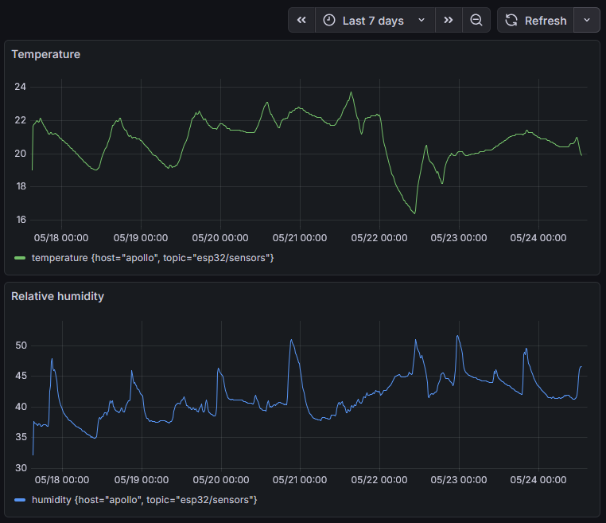

Last year I bought a [Beelink Mini S mini PC](https://www.bee-link.com/products/beelink-mate-mini-s-dock) as a way to start building a small “homelab”/[home server](https://en.wikipedia.org/wiki/Home_server).

I already had a 2TB external Toshiba HDD I’d been using for backups for years, where I keep photos, videos, personal files, and other stuff, so I connected it to the mini PC to create a basic setup between the two.

The mini PC came with Windows 11 installed, but to make it lighter and mostly out of personal preference I replaced it with Debian Linux.

Over the past year I gradually added a few services to the mini PC, which stays on 24/7, and to the broader “system” made up of the devices I have at home.

## [Syncthing](https://syncthing.net/)

A continuous file synchronization program that uses [its own protocol](https://docs.syncthing.net/specs/bep-v1.html#bep-v1). I’ve been using it since around 2024 to sync folders and files in real time between my phone, laptops, and desktop PC.

Before that I used Google Drive for this kind of thing, but considering cost, speed, privacy, and the fact that I mostly use it for personal files, continuing to rely on something like Drive stopped making much sense. Switching to something like Syncthing felt much more reasonable. Highly recommended.

## [Jellyfin](https://jellyfin.org/)

An open-source [media server](https://en.wikipedia.org/wiki/Jellyfin).

To watch movies and shows from the server on my TV I bought a [Xiaomi TV Stick 4K](https://www.mi.com/ar/product/xiaomi-tv-stick-4k/), which runs Android TV and lets me install the Jellyfin app.

The setup basically looks like this:

    Movies and TV shows stored on external Toshiba HDD
         ↓
    Jellyfin Server running on Beelink mini PC
         ↓
    Xiaomi TV Stick with Android TV + Jellyfin app
         ↓ (HDMI)
    Samsung TV

## [Calibre](https://calibre-ebook.com)

I’ve been organizing my books with this application for years, but recently I wanted to run a server for it so I could keep a single library accessible from any device while storing the books on the external HDD.

It was actually one of the easiest things I’ve self-hosted so far since the whole thing is [pretty well polished](https://manual.calibre-ebook.com/server.html).

It’s not the most comfortable or ideal experience to browse through a web browser, but for reading it’s enough.

## [Grafana](https://grafana.com/)

I’ve never actually used Grafana at work, and it’s probably overkill for my use case, but it was a good excuse to learn a bit about it.

I use [Prometheus](https://prometheus.io/) to collect and store general metrics from the mini PC such as temperature, disk usage, and so on, and [InfluxDB](https://www.influxdata.com/) for data coming from an [ESP32](https://en.wikipedia.org/wiki/ESP32) with a temperature and humidity sensor, a small project I’ll write about in another post.

Temperature and relative humidity visualized in Grafana for the room where the server lives in May 2026.

## nginx

This personal site used to be hosted on GitHub Pages, but mostly as a hobby, for learning, and because I enjoy tinkering with this stuff, it’s now served through a [Cloudflare Tunnel](https://developers.cloudflare.com/tunnel/) pointing to an nginx instance running on the mini PC.

Maybe at some point I’ll replace what Cloudflare is doing for me now, but for the moment it saves me from dealing with NAT, my dynamic IP, ISP router configuration, bots, and so on.

After moving away from GitHub Pages and onto nginx, [serving this](https://lojeda.co/asteroids) became trivial compared to what I would’ve had to do before.

Since I’d like to add more routes in the future with projects or anything else I might want to share — for example recipes written in Markdown that I keep in Obsidian — moving to nginx felt like the better long-term setup.

## [Samba](https://en.wikipedia.org/wiki/Samba_(software))

A free software implementation of the SMB protocol used by Windows.

Running Samba on the mini PC lets me mount the Toshiba HDD as a network drive on my desktop PC whenever I need to move or copy files more easily.

To make transferring large files like videos faster, both the desktop PC and the mini PC are connected over Ethernet so I can take advantage of the speed and proximity between them without relying on Wi-Fi unnecessarily.

For that I configured Samba to bind only to the mini PC’s Ethernet interface.
