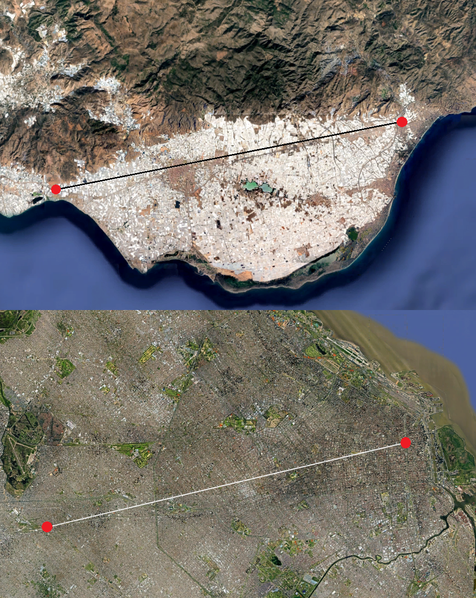
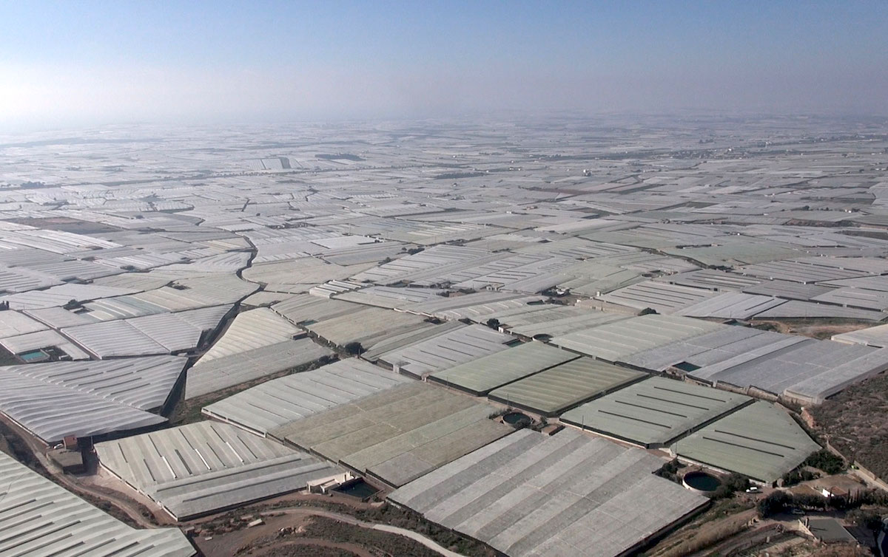
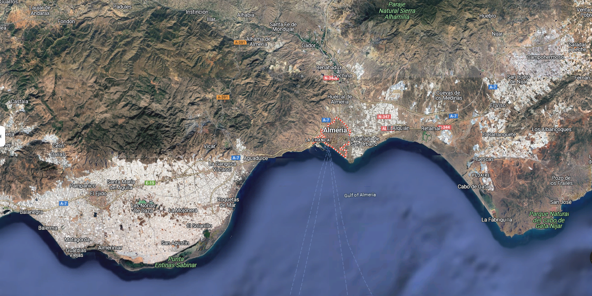
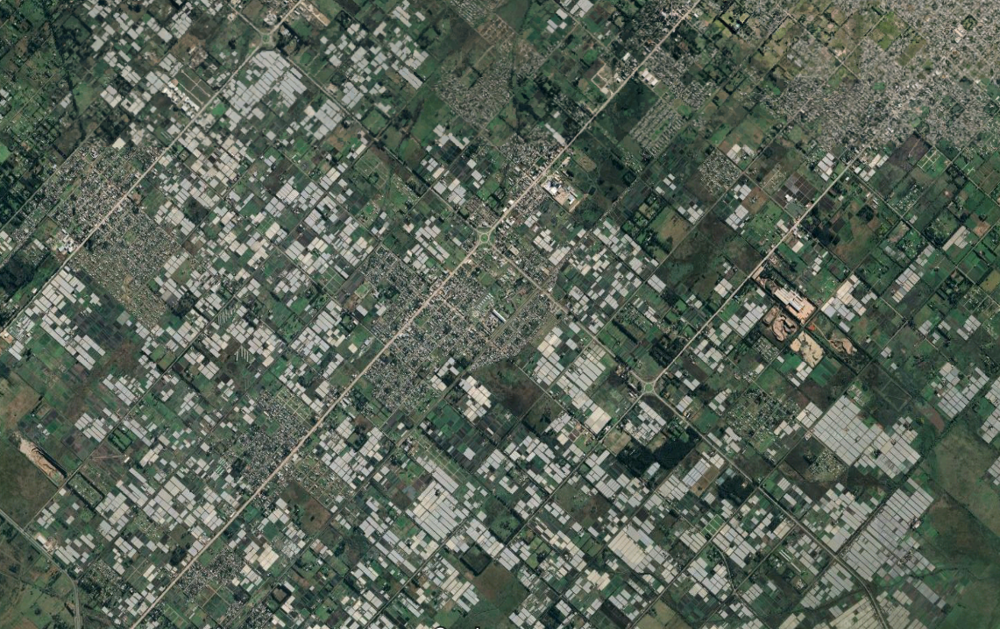

Leyendo [How the World Really Works](https://www.goodreads.com/book/show/56587388-how-the-world-really-works) me enteré que en Almería, España, está el area cultivada cubierta de mayor extensión a nivel mundial. Es utilizada principalmente para tomates, melones, morrones y otras frutas y verduras cultivadas fuera de estación.

Es tan extensa el área que se puede ver fácilmente desde Google Maps/Earth. En la siguiente imagen comparé la Ciudad Autónoma de Buenos Aires con estas zonas de cultivo. La línea va desde el obelisco hasta el barrio de Merlo aproximadamente. La cual tiene la misma extensión que la línea de la imagen de España, alrededor de unos 20km:

A una menor altura:

Y haciendo un zoom out se pueden ver aún más hacia el Este:

Me resultó un dato interesante ya que no tenía idea que existiera algo así. No al menos a esta escala ya que en diciembre del año pasado fui a Punta Indio, en la provincia de Buenos Aires, y atravesando la ruta 36 se pueden encontrar áreas cubiertas similares:

El área total cubierta es mucho menor y no se ve tan fácil desde grandes alturas como en el caso de Almeria. Pero lo traigo al post como dato de color el que también tengamos este tipo de agricultura en nuestro país.

Y como _todo tiene que ver con todo_, la cantidad de invernaderos cerca de la Plata se considera como una de las causas de [la inundación del 2013](https://es.wikipedia.org/wiki/Inundaci%C3%B3n_en_La_Plata_de_2013#Algunas_causas_de_la_inundaci%C3%B3n) ya que son unas 1500 a 2000 manzanas impermeabilizadas, el agua cayó sobre el polietileno de los invernaderos y gran parte escurrió hacia la ciudad al Este.