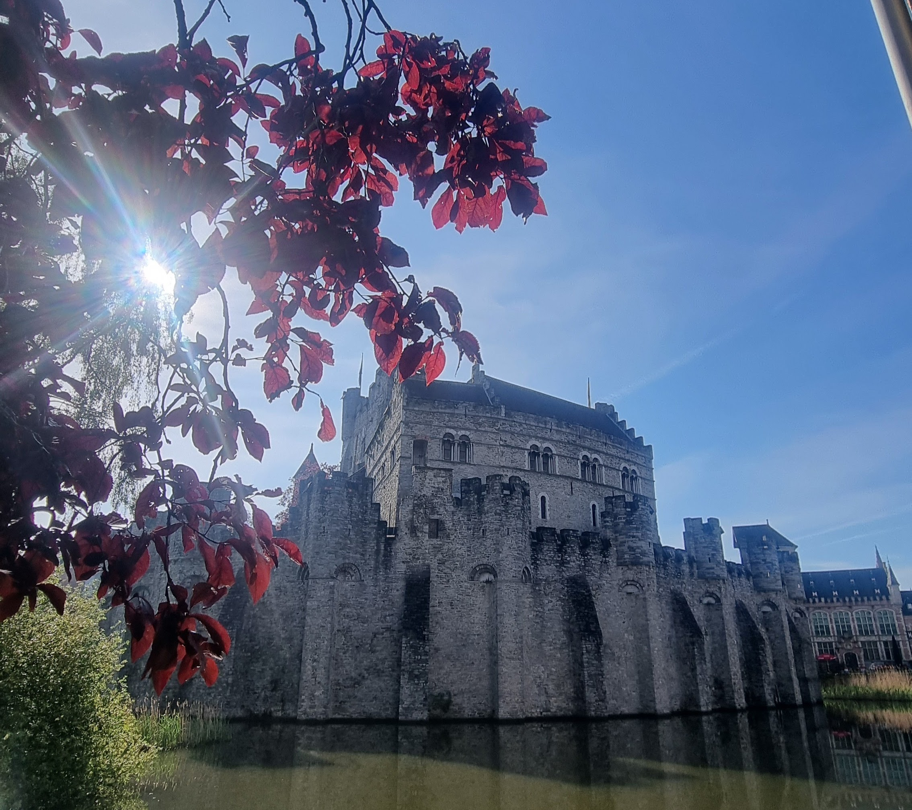
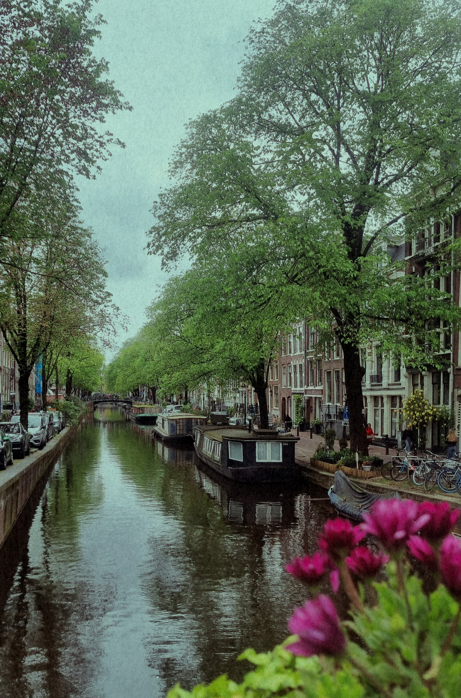
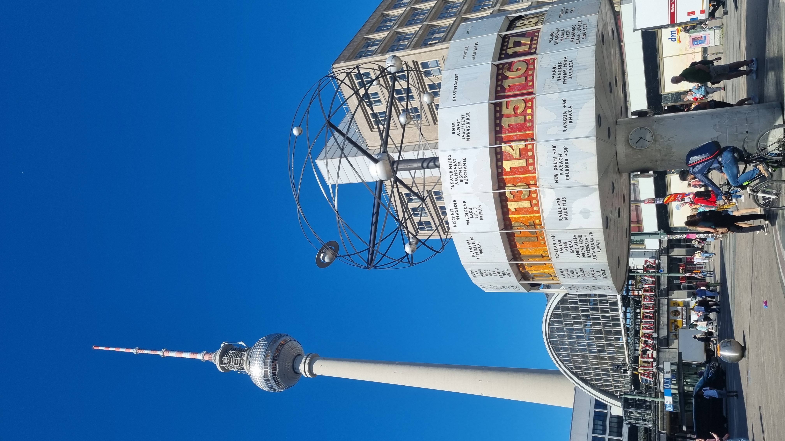
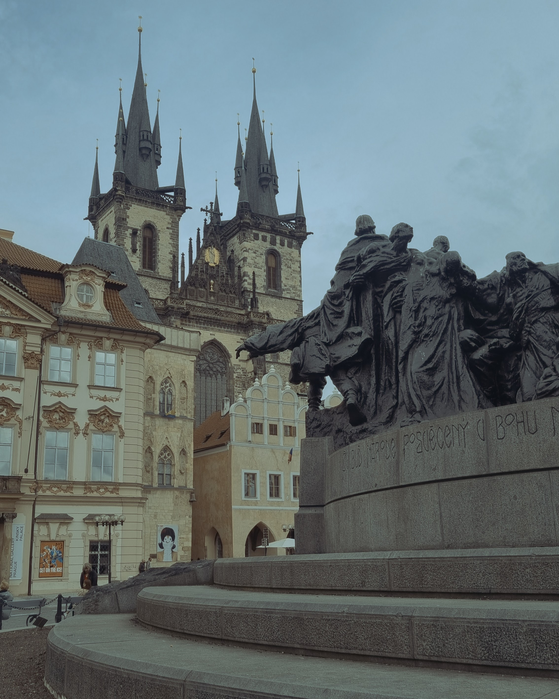

El 22 de mayo volví de viaje sola por Europa, primera vez en otro continente. Recorrí 5 ciudades en 20 noches:
- 🇨🇭 [Fribourg (Suiza)](#suiza)
- 🇧🇪 [Ghent (Bélgica)](#bélgica)
- 🇳🇱 [Amsterdam (Países Bajos)](#amsterdam)
- 🇩🇪 [Berlín (Alemania)](#berlín)
- 🇨🇿 [Praga (Rep. Checa)](#praga)

Excepto Madrid -> Zurich y Praga -> Madrid (al volver) hice todo los recorridos en tren. Usé el pase de [Eurail](https://www.eurail.com/en) y considerando que a mi me parecía bastante más confuso de lo que al final fue allá me gustaría ayudar con mi experiencia.

Estuve una noche en Madrid pero no la incluyo a continuación ya que me dediqué a hacer compras durante todo el día y descansar.

Como forma de resumir lo que me pareció más destacable y recomendaciones de alojamiento escribí este post.

## Suiza
### lo que me gustó:
- [Ciudad vieja de Berna](https://es.wikipedia.org/wiki/Ciudad_vieja_de_Berna): parece salida de un cuento de fantasía. Mención especial a la [catedral](https://es.wikipedia.org/wiki/Catedral_de_Berna)
- Los trenes. Su puntualidad, modernidad, velocidad y limpieza.

## Bélgica
### Alojamiento
- [Kaba hostel](http://www.kabahostel.be/en)
- Recomiendo: sí. Buen desayuno y buena ubicación. No tiene ascensor y fue incómodo subir la valija tres pisos, pero es lo único malo que le encontré.

### lo que me gustó
- [Castillo de Gravensteen](https://es.wikipedia.org/wiki/Castillo_de_los_Condes_de_Gante)
    - Sacar tickets con antelación [acá](https://historischehuizen.stad.gent/en/castle-counts/visit/book-tickets)
- [Atomium](https://en.wikipedia.org/wiki/Atomium): a 30' en subte del centro de Bruselas. No tiene demasiado por ver por dentro, pero es un monumento de la década de 1950 imponente que sale del típico recorrido de monumentos clásicos, catedrales y vistas de siglos pasados.

## Amsterdam
### Alojamiento
- [Cocomama](https://cocomamahostel.com/)
- Recomiendo: sí. Excelente ambiente de gente y área común abarcando cocina/living/patio. La limpieza dejaba un poco que desear.

### lo que me gustó
- La _enorme_ diversidad de bienes y servicios disponible. Quizás para alguien del primer mundo no sea algo destacable para una argentina comoyo lo fue. No puedo recomendar [este local](https://www.fantasyshopchimera.com/) de productos de fantasía de todo tipo lo suficiente.
- La facilidad para moverse en bicicleta. No le creía a Google Maps que realmente fuera más rápido que caminar e ir en auto pero sí.
- Rijksmuseum
    - Ir lo más temprano posible, apenas abra.
    - Recomiendo bajar la app y contratar el tour guiado de una hora.
    - Imposible de recorrer en un día. Hacer una lista de exhibiciones must-see antes, como [La Ronda de Noche](https://es.wikipedia.org/wiki/La_ronda_de_noche) de Rembrandt.

## Berlín
### Alojamiento
- [Circus Hostel](https://circus-berlin.de/)
- Recomiendo: depende. Si viajás solo/a, te interesa socializar y no te importa mucho la ubicación _no_. El área común no está bien diseñada para que ocurra interacción entre personas de forma natural ni tiene una cocina. Es más un hotel "barato", y ni tanto. Si te importa mucho la ubicación, que es excelente, y viajás en pareja/grupo podés buscar una habitación doble sin notar las contras que destaco.

### lo que me gustó
- Berghain y Tresor. Ambas ex-fábricas reconvertidas en clubes de techno y tech-house.
- Parques
- Monumentos históricos: tengo un sesgo enorme por mi interés en la historia alemana desde que tengo memoria. No pude evitar emocionarme al ver la puerta de Brandenburgo.
- Cementerio del sudoeste Stahnsdorf: lugar donde filmaron escenas de la serie de Netflix Dark, es un parque enorme tranquilo donde te podés perder por horas. A una hora de Berlín. Si te gustan los cementerios como a mi recomendadísimo.

## Praga
### Alojamiento
- [Sir Toby's](https://sirtobys.com/)
- Recomiendo: un montón. El área común consiste en un bar, living con amplios sillones, mesa y cocina en el sótano del edificio de estilo rústico con muebles principalmente de madera. También tiene un patio muy amplio para fumar y/o relajarse al sol/aire libre.

### lo que me gustó
- Old town
- [Cold War Museum](http://en.muzeum-studene-valky.cz/): si te interesa la historia del siglo 20 es un _must_. Un búnker debajo de un hotel con armas, herramientas, vestimenta y demás remanentes de la época comunista de Checoslovaquia. Sacar tickets con antelación porque son grupos chicos.
- Hostel: conocí personas excelentes y me hizo notar, junto a mis experiencias en los hosteles de Berlín y Amsterdam, cuan importante puede ser el área común en cuanto a los vínculos que se generan o no entre personas. En otro post me gustaría explayarme más sobre esto. Pero definitivamente el alojamiento le sumó muchísimo a los días que estuve en Praga.

